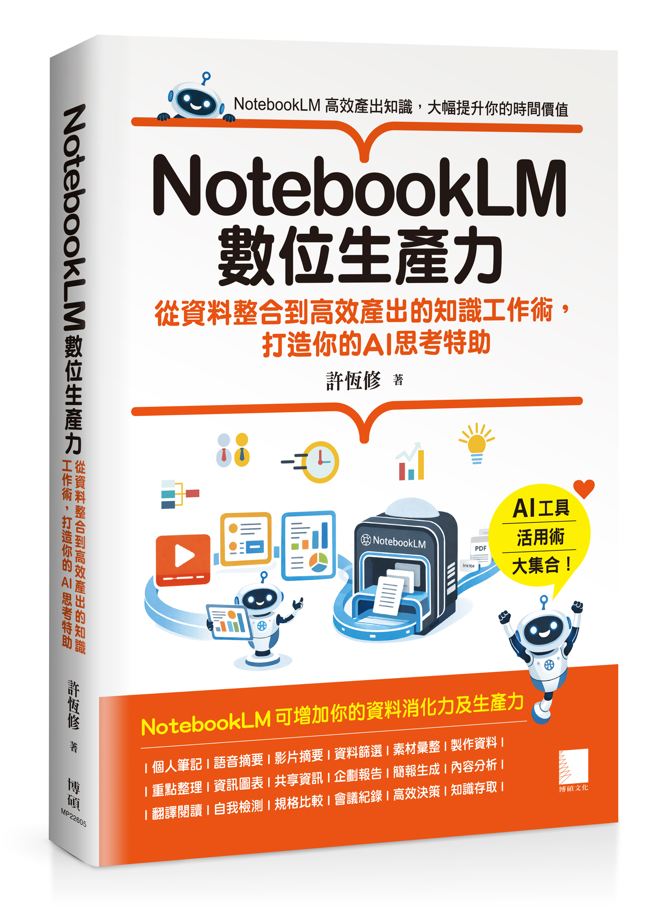

# NotebookLM數位生產力：從資料整合到高效產出的知識工作術，打造你的AI思考特助
<a href="https://www.tenlong.com.tw/products/9786264144773"></a>

此儲存庫為 博碩出版社《NotebookLM數位生產力：從資料整合到高效產出的知識工作術，打造你的AI思考特助》的搭配程式範例。
一書中各章節實作所需的完整素材。讀者可以依照書中進度，將對應資料夾內的 PDF、圖片、或是 `.txt` 內的連結匯入 NotebookLM，親自體驗 AI 驅動的知識管理流程。
上方圖片 `MP22605.png` 為書籍封面，已放在專案根目錄，可直接在 README 中顯示。

## 購書管道（點擊前往）

- [天瓏書局（實體書現貨購買）](https://www.tenlong.com.tw/products/9786264144773)
- [博客來（實體書現貨購買）](https://www.books.com.tw/products/0011048248?loc=M_0005_002)
- [讀冊生活（TAAZE）（實體書現貨購買）](https://www.taaze.tw/products/11101086780.html)
- [金石堂](https://www.kingstone.com.tw/basic/2013120767089/?lid=categoryranking_book_la)
- [MoMo（實體書現貨購買）](https://www.momoshop.com.tw/goods/GoodsDetail.jsp?i_code=15060197&Area=search&mdiv=403&oid=1_1&cid=index&kw=NotebookLM%E6%95%B8%E4%BD%8D%E7%94%9F%E7%94%A2%E5%8A%9B)
- [博碩文化 蝦皮購物（實體書現貨購買）](https://shopee.tw/search?keyword=notebooklm%E6%95%B8%E4%BD%8D%E7%94%9F%E7%94%A2%E5%8A%9B&shop=728783014)
- [Kobo 樂天（電子書醞釀中）](https://www.kobo.com/tw/zh/search?query=NotebookLM%E6%95%B8%E4%BD%8D%E7%94%9F%E7%94%A2%E5%8A%9B&fclanguages=zh&ssid=8g7xKJ2cUFxTmjA86Tf7K&sid=b1594609-7fd3-470e-9457-a82963d7d16c)
- [Readmoo（讀墨，電子書醞釀中）](https://readmoo.com/search/keyword?q=NotebookLM%E6%95%B8%E4%BD%8D%E7%94%9F%E7%94%A2%E5%8A%9B&kw=NotebookLM%E6%95%B8%E4%BD%8D%E7%94%9F%E7%94%A2%E5%8A%9B&page=1&st=true)
- [Pubu（電子書醞釀中）](https://www.pubu.com.tw/search?q=NotebookLM%E6%95%B8%E4%BD%8D%E7%94%9F%E7%94%A2%E5%8A%9B)
- [Google Play 圖書（，電子書醞釀中）](https://play.google.com/store/search?q=NotebookLM%E6%95%B8%E4%BD%8D%E7%94%9F%E7%94%A2%E5%8A%9B&c=books&hl=zh_TW)
- [HyRead（凌網，，電子書醞釀中）](https://ebook.hyread.com.tw/searchList.jsp?search_field=FullText&search_input=NotebookLM%E6%95%B8%E4%BD%8D%E7%94%9F%E7%94%A2%E5%8A%9B)
- [UDN 讀書吧（，電子書醞釀中）](https://www.books.com.tw/products/0011048248?loc=M_0005_002)

## 專案目錄
---------------------

本儲存庫依據書中「七大部」架構編排，方便讀者快速找到實作素材：

- `01_第一部、新手村篇/` — 快速上手 NotebookLM，建立第一個 AI 筆記本與來源管理。
- `02_第二部、核心篇/` — 深度掌握筆記功能、多媒體素材匯入技巧與 AI 互動對話。
- `03_第三部、工作室篇/` — AI 內容創作實務，包含腳本撰寫、論文分析與長篇筆記管理。
- `04_第四部、團隊篇/` — 團隊協作應用，如何共享筆記本與建立跨部門知識庫。
- `05_第五部、生活整理篇/` — 生活場景實作：租屋補助文件 analysis、產品規格對比、旅遊行程管理。
- `06_第六部、商務效率篇/` — 職場效率倍增：會議記錄整理、差旅制度檢索、企劃案審閱與問卷分析。
- `07_第七部、學習複利篇/` — 深度學習與知識內化：技術規格書導讀、中西經典文學（道德經、君王論）深度剖析。

## 使用指南

1. **克隆此 Repository**：
   將所有實作範例素材下載至您的電腦：
   ```bash
   git clone https://github.com/Heng-xiu/notebooklm-productivity-playbook.git
   ```

2. **尋找對應章節素材**：
   請根據書中提及的章節進入對應資料夾。例如：若您正在閱讀「第 23 章：產品實測」，請進入 `05_第五部、生活整理篇/ch23/` 即可找到 NW-X1 吹風機的說明書與實測圖檔。

3. **匯入 NotebookLM**：
   - 開啟 [NotebookLM 官方網站](https://notebooklm.google.com/)。
   - 建立新的筆記本，點選「新增來源（Add Source）」。
   - 將本儲存庫中的 PDF 或圖片直接上傳，或將 `.txt` 檔案中的 URL 加入連結。

## Star 趨勢

[](https://star-history.com/#Heng-xiu/LangGraph-Practical-Guide-to-Developing-AI-Agents&Date)

## 提問、回饋與貢獻此資料庫

我非常歡迎各種形式的回饋，最適合透過 [GitHub Discussions](https://github.com/Heng-xiu/notebooklm-productivity-playbook/discussions) 分享。 同樣地，如果您有任何問題，或只是想與其他人交流想法，也請不要猶豫在論壇中提出。
請注意，由於此資料庫包含與實體書對應的程式碼，目前無法接受會擴充主要章節程式碼內容的貢獻，因為這會導致與實體書出現差異。保持一致性有助於確保所有讀者都能獲得流暢的使用體驗。

 
## 引用

如果您覺得本書或程式碼對您的研究有所幫助，請考慮引用它。

Chicago 格式引用：

> Sheu, Heng-Shiou. *NotebookLM數位生產力：從資料整合到高效產出的知識工作術，打造你的AI思考特助*. 博碩文化, 2025. ISBN: 978-626-414-477-3.

BibTeX 格式引用：

```
@book{notebooklm-productivity-playbook,
  author       = {Heng-Shiou Sheu},
  title        = {NotebookLM數位生產力：從資料整合到高效產出的知識工作術，打造你的AI思考特助},
  publisher    = {drmaster},
  year         = {2026},
  isbn         = {978-626-414-477-3},
  url          = {https://www.drmaster.com.tw/Bookinfo.asp?BookID=MP22605},
  github       = {https://github.com/Heng-xiu/notebooklm-productivity-playbook}
}
```
